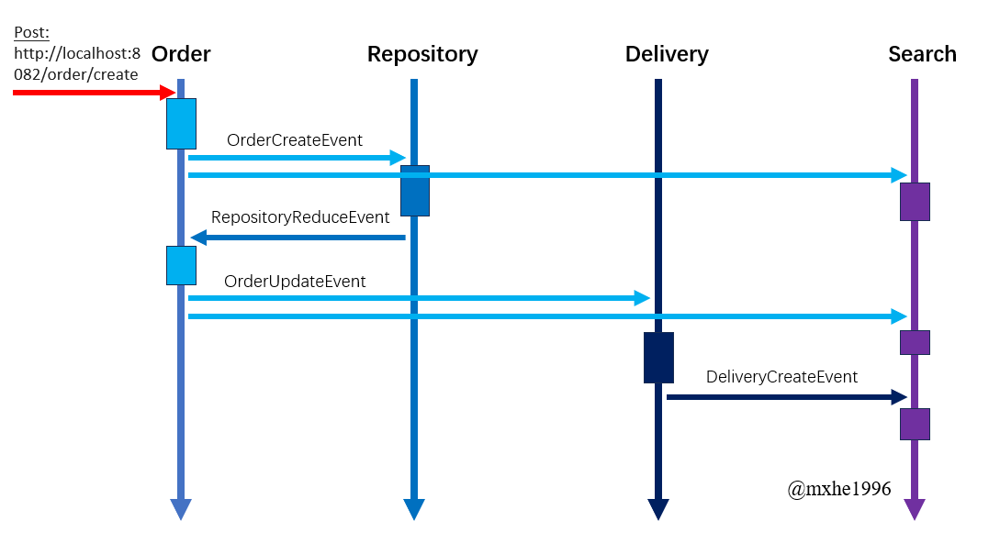
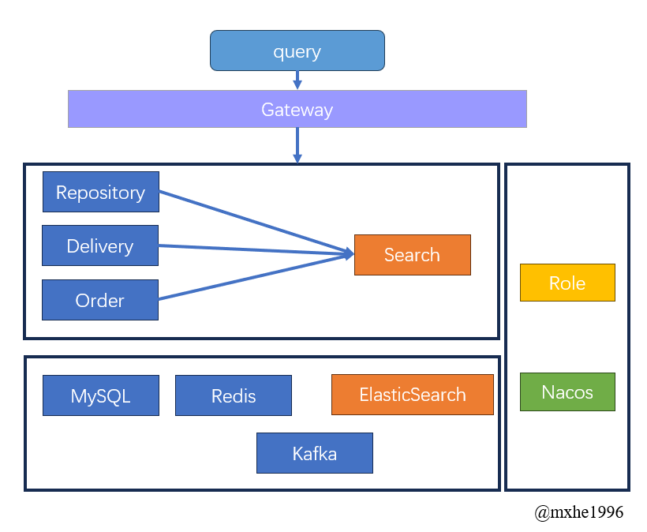
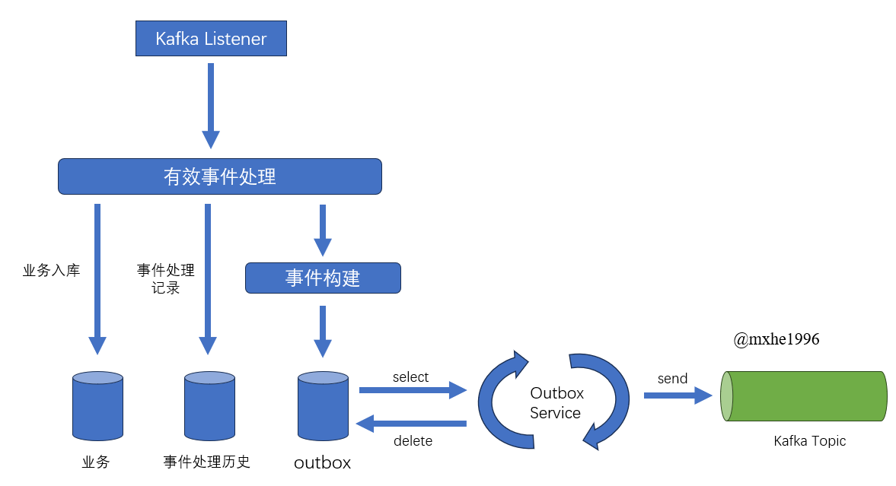

### 介绍
采用Order订单、repository仓库、delivery物流以及search查询等微服务组成。   
用于模拟创建订单，仓库减少对应数量物品，开启启动物流等，以及对于用户的可查询操作。      

查询采用CQRS模式，search微服务接受其他业务模块的UCD事件，对外提供R操作接口。

### 生产环境组件版本

1.  kafka 3.3.2
2.  elasticsearch 8.11.3
3.  mysql 5.7
4.  redis
5.  nacos
6.  jdk 1.8

### 使用说明

**启动说明**：
1.  在nacos中配置druid、kafka、redis，并在每个微服务的`bootstrap-dev.yml`中填写对应的nacos地址
2.  确保开启kafka、elasticsearch

**业务流程**：    
该系统用于模拟从下单到库存减少到发送货物等一系列流程，整个时序图如下图所示：



### 软件架构
软件架构采用Alibaba SpringCloud为基础架构，3个业务模块主要基于mysql、redis、kafka设计业务逻辑和事件任务。
查询模块响应业务微服务的事件，在es中做出对应的文档创建和更新。   

微服务注册采用nacos,
在Repository服务中涉及用户的权限校验和不同响应，但该系统暂时没有动态的角色权限功能，如有需要，请在`redis-common`中的`SecurityUtils`中调整。   
暂时没有gateway网关，因此需要区分不同端口调用接口。   


不同微服务之间采用事件通信，事件依赖于kafka消息队列分发。  
为尽可能保证事件通讯上的高可用和幂等，在接收端上通过记录事件历史来确认当前事件消息是否有效。  
kafka本身对事务不支持，保证接口处理与消息发送的事务性，将事件包装为对事务有较好支持的mysql，再从mysql中读取事件，分发到对应的topic




### 测试案例

**提交订单**
```json 
// http://localhost:8082/order/create
{
  "orderItems": [
    {
      "itemId": 6,  // 对应book表book_id
      "itemName": "订购的书名1", // 对应book表book_name
      "tenantId": 4, // 对应book表tenant_id
      "tenantName": "书1的出版社", // 对应book表tenant_name
      "orderNumber": 1, // 该物品的购买数量
      "price": 5800  // 对应book表price,单位:分
    },
    {
      "itemId": 3,
      "itemName": "订购的书名2",
      "tenantId": 2,
      "tenantName": "书2的出版社",
      "orderNumber": 1,
      "price": 8800
    }
  ]
}
```
当成功提交订单后，会在elasticsearch中生成对应的document，再完成一系列事件中该document会不断更新。   
可以通过`http://localhost:8083/search/fuzzy/query?likeWord=` 对elasticsearch中的数据查询。   

**更新行程**  
如需要更新物流delivery的行程：
```json
// http://localhost:8084/delivery/add
{
    "deliveryId":1, // 订单Id: 对应表delivery的delivery_id
    "phaseDetailList": [
        {
            "phaseTime": "2024-07-10T11:03:10", // 时间格式
            "comment" : "xxx营业厅正在揽件"  // 时间节点说明
        }
    ]
}
```
成功更新delivery行程后，会异步发送事件更新document

----
**新加功能**
* gateway过滤，请求头jwt鉴权，用户临时登录/登出接口
* 添加前缀索引，过滤非幂等性消息消费


### 参考文献

1. 克里斯·理查森.微服务架构与设计模式[M]机械工业出版社.2019
